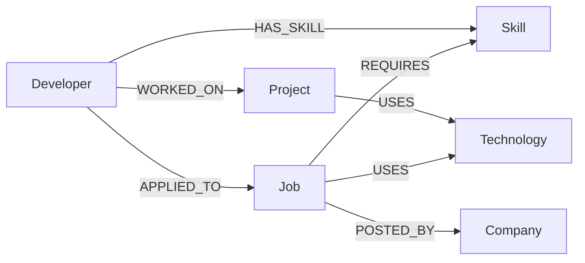
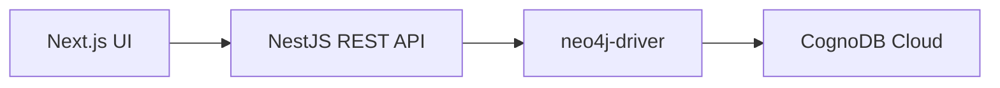
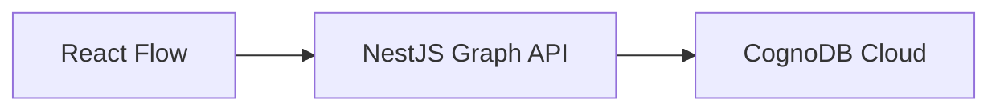

# JobMatch Graph

Graph-Powered Job & Skill Gap Recommendation System

JobMatch Graph recommends jobs from a developer’s skills, project history, and job requirements stored in **CognoDB Cloud**. Scores are **deterministic and explainable**. There is no AI, ML, or embedding model.

A developer can:

1. Select a profile
2. View recommended jobs
3. Inspect an explainable match score
4. See matched and missing skills
5. See technology overlap from project history
6. Explore the underlying graph in React Flow

The Next.js UI talks only to the NestJS REST API. The frontend never connects to CognoDB.

---

## Key features

- Developer profile selection
- Ranked job recommendations
- Explainable match score with component breakdown
- Required (must-have) skill matching
- Nice-to-have skill matching
- Technology overlap via project history
- Experience-level fitness (`junior` / `mid` / `senior`)
- On-demand skill-gap analysis
- Exclusion of jobs the developer has already applied to
- Graph Explorer (React Flow), loaded only when opened
- Swagger / OpenAPI at `/api/docs`
- Responsive Next.js dashboard

---

## Why a graph database?

Job matching is a **relationship** problem: who has which skills, which jobs require them, which projects used which tools, and which jobs a person already applied to.

CognoDB stores those facts as nodes and edges:



The important multi-hop path is:

**Developer → WORKED_ON → Project → USES → Technology ← USES ← Job**

That traversal finds technologies a developer has used on projects that a job also uses. The same question can be expressed in SQL with join tables; the graph model makes the hops **explicit and natural** to query, score, and visualize.

---

## Architecture



Graph Explorer:



All Cypher runs on the server, parameterized. The client never sends queries or database credentials.

---

## Technology stack

| Layer | Technologies |
|--------|----------------|
| Frontend | Next.js, React, TypeScript, Tailwind CSS, shadcn/ui, React Flow (`@xyflow/react`) |
| Backend | NestJS, TypeScript, neo4j-driver |
| Database | CognoDB Cloud, Bolt + TLS (`bolt+s://`), openCypher / Cypher |
| API | REST, Swagger / OpenAPI |

---

## Graph model

**Node labels:** `Developer`, `Skill`, `Job`, `Company`, `Project`, `Technology`

**Relationship types:** `HAS_SKILL`, `WORKED_ON`, `USES`, `REQUIRES`, `POSTED_BY`, `APPLIED_TO`

`USES` appears on both **Project → Technology** and **Job → Technology**.

Full property and constraint details: [docs/graph-model.md](docs/graph-model.md)

---

## Dataset

Demonstration seed data (not live job listings). Counts after a successful seed:

| Nodes | Count | Relationships | Count |
|-------|------:|---------------|------:|
| Developers | 8 | `HAS_SKILL` | 71 |
| Skills | 30 | `WORKED_ON` | 12 |
| Jobs | 18 | `USES` | 100 |
| Companies | 6 | `REQUIRES` | 97 |
| Projects | 12 | `POSTED_BY` | 18 |
| Technologies | 20 | `APPLIED_TO` | 5 |

The seed script is **idempotent**: running it again does not duplicate nodes or relationships.

---

## Recommendation scoring

Recommendations consider **open** jobs the developer has **not** `APPLIED_TO`. Cypher returns graph facts; NestJS computes scores (rounded to one decimal).

```
overall = mustHave × 0.60
        + niceToHave × 0.20
        + technologyOverlap × 0.15
        + levelFitness × 0.05
```

| Component | Weight | Formula |
|-----------|-------:|---------|
| Must-have coverage | 60% | matched required / total required (100 if the job lists none) |
| Nice-to-have coverage | 20% | matched optional / total optional (**100** if the job lists none) |
| Technology overlap | 15% | overlapping job technologies / total job technologies (**0** if the job lists none) |
| Level fitness | 5% | seeded levels `junior` < `mid` < `senior` |

**Level fitness**

| Developer vs job | Score |
|------------------|------:|
| Exact match | 100 |
| One level above | 100 |
| One level below | 60 |
| Two or more levels below | 20 |
| Two or more levels above | 50 |

Query and scoring notes: [docs/queries.md](docs/queries.md)

---

## Skill gap

Skill gap is **job required skills minus developer skills** (plus the same split for nice-to-have). The UI shows:

- Matched required skills
- Missing required skills
- Matched nice-to-have skills
- Missing nice-to-have skills

Fetched only when the skill-gap dialog is opened.

---

## API endpoints

Base path: `/api`. All CognoDB access goes through NestJS.

| Method | Path |
|--------|------|
| `GET` | `/api/health` |
| `GET` | `/api/health/ready` |
| `GET` | `/api/developers` |
| `GET` | `/api/developers/:id` |
| `GET` | `/api/jobs` |
| `GET` | `/api/jobs/:id` |
| `GET` | `/api/companies/:id` |
| `GET` | `/api/recommendations/:developerId` |
| `GET` | `/api/recommendations/:developerId/jobs/:jobId/skill-gap` |
| `GET` | `/api/graph/match/:developerId/:jobId` |

Swagger UI: [http://localhost:3001/api/docs](http://localhost:3001/api/docs)

---

## Project structure

```
/
├── backend/
│   ├── src/
│   ├── scripts/
│   └── package.json
├── frontend/
│   ├── app/
│   ├── components/
│   ├── hooks/
│   ├── lib/
│   ├── types/
│   └── package.json
├── docs/
│   ├── architecture.md
│   ├── graph-model.md
│   └── queries.md
├── README.md
└── .gitignore
```

---

## Local development

**Prerequisites:** Node.js, npm, and a CognoDB Cloud instance.

### Backend

```bash
cd backend
npm install
```

Copy the example env file and fill in your CognoDB password locally. Do not commit `.env`.

```bash
# macOS / Linux
cp .env.example .env

# Windows (PowerShell)
Copy-Item .env.example .env
```

```
COGNODB_URI=bolt+s://xxxx.databases.cognodb.com
COGNODB_USER=cognodb
COGNODB_PASSWORD=
PORT=3001
CORS_ORIGIN=http://localhost:3000
```

```bash
npm run start:dev
```

- API: [http://localhost:3001](http://localhost:3001)
- Swagger: [http://localhost:3001/api/docs](http://localhost:3001/api/docs)

### Frontend

```bash
cd frontend
npm install
```

```bash
# macOS / Linux
cp .env.example .env.local

# Windows (PowerShell)
Copy-Item .env.example .env.local
```

```
NEXT_PUBLIC_API_BASE_URL=http://localhost:3001/api
```

```bash
npm run dev
```

UI: [http://localhost:3000](http://localhost:3000)

### Seed data

From `backend/`:

```bash
npm run seed
npm run verify:graph
```

Seed is idempotent.

### Build

From `backend/`:

```bash
npm run build
```

From `frontend/`:

```bash
npm run build
```

---

## Security

- CognoDB credentials live in environment variables (`backend/.env` is gitignored)
- The frontend never receives CognoDB credentials
- There is no arbitrary Cypher endpoint
- Dynamic Cypher values are parameterized (`$developerId`, `$jobId`, …)
- `CORS_ORIGIN` is configurable; production does not default to localhost
- API error responses do not expose stack traces, URIs, credentials, or Cypher

---

## Demo flow

1. Open JobMatch at http://localhost:3000
2. Select a developer
3. Review ranked jobs and score breakdown
4. Open **View skill gap**
5. Open **Explore match graph**
6. Inspect Developer → Project → Technology → Job paths

---

## Documentation

- [docs/architecture.md](docs/architecture.md) — system design and API overview
- [docs/graph-model.md](docs/graph-model.md) — labels, properties, relationships
- [docs/queries.md](docs/queries.md) — Cypher and scoring

---

## Deployment

Hosting depends on the provider. For a **Render** Web Service of the NestJS API:

| Setting | Value |
|---------|--------|
| Root Directory | `backend` |
| Build Command | `npm install && npm run build` |
| Start Command | `npm run start:prod` |

Set environment variables in the host (never commit them):

- `COGNODB_URI`
- `COGNODB_USER`
- `COGNODB_PASSWORD`
- `CORS_ORIGIN` (your frontend origin, for example `https://your-frontend.onrender.com`)
- `NODE_ENV=production`

Render injects `PORT`. The API listens on that value.

The Next.js frontend is a separate static/web service. Set `NEXT_PUBLIC_API_BASE_URL` to the deployed API base, including `/api`.
