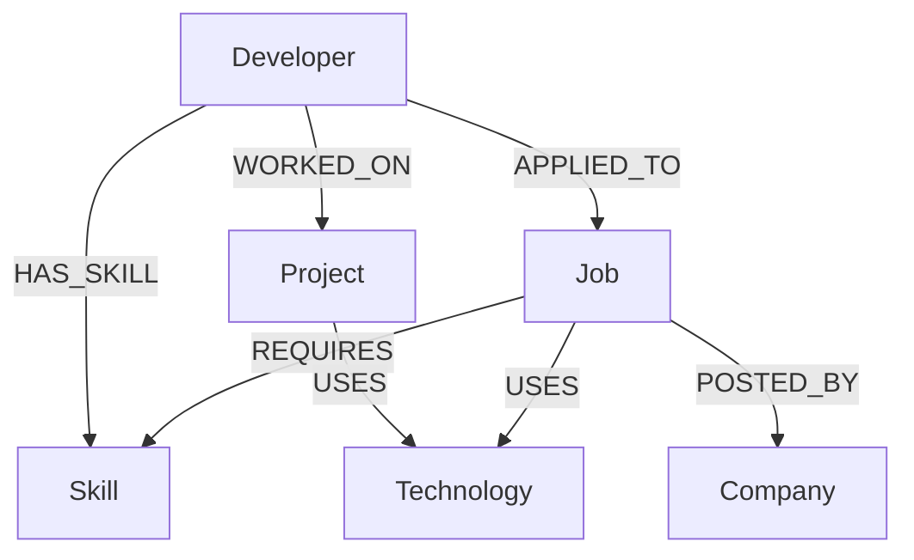

# JobMatch Graph — Graph Data Model

This document describes the CognoDB graph used by JobMatch Graph. It is the source of truth for node labels, properties, and relationship types.

CognoDB is the only application database. Matching, skill-gap analysis, and graph exploration are relationship traversals — not table joins.

## Why a graph database

Job matching is a neighborhood problem:

1. **Direct match** — a developer’s skills compared with a job’s required skills (`HAS_SKILL` vs `REQUIRES`).
2. **Skill gap** — required skills that are *not* connected to the developer. That is set difference over a graph neighborhood.
3. **Multi-hop context** — technologies a developer used on projects that a job also uses (`Developer → Project → Technology ← Job`). That path is two hops and is awkward to express as a chain of join tables.
4. **Explainability** — “why this job matches” is a set of paths. Cypher can return those paths; the UI can draw them.

A relational model would need several join tables (`developer_skills`, `job_skills`, `project_technologies`, `job_technologies`, `applications`) and recursive or multi-join queries for the same questions. The graph keeps those relationships as first-class edges.

## Why Skill and Technology are separate

| Label | Role |
|-------|------|
| **Skill** | Capability a developer *has* or a job *requires*. This is the matching currency. |
| **Technology** | Tool used by a project or a job. This is context and a multi-hop similarity signal. |

Keeping them separate avoids forcing every tool into both roles. TypeScript can be a skill a person knows *and* a technology a project uses; they remain distinct node types so matching stays explicit (`HAS_SKILL` / `REQUIRES`) while project overlap stays explicit (`USES`).

## Diagram



## Node labels and properties

Every node has a unique application-level string `id` (stable seed slugs such as `dev-alice`, `skill-typescript`). Uniqueness is enforced in CognoDB.

### Developer

| Property | Type | Required | Meaning |
|----------|------|----------|---------|
| `id` | string | yes | Stable identifier |
| `name` | string | yes | Display name |
| `email` | string | yes | Contact email |
| `title` | string | yes | Current / target role title |
| `experienceYears` | number | yes | Years of experience |
| `experienceLevel` | string | yes | `junior`, `mid`, or `senior` |
| `location` | string | yes | City or region |

### Skill

| Property | Type | Required | Meaning |
|----------|------|----------|---------|
| `id` | string | yes | Stable identifier |
| `name` | string | yes | Skill name |
| `category` | string | yes | e.g. `language`, `framework`, `database`, `cloud`, `devops`, `practice` |

### Job

| Property | Type | Required | Meaning |
|----------|------|----------|---------|
| `id` | string | yes | Stable identifier |
| `title` | string | yes | Job title |
| `description` | string | yes | Role description |
| `location` | string | yes | Location or `Remote` |
| `employmentType` | string | yes | e.g. `full-time`, `contract` |
| `experienceLevel` | string | yes | `junior`, `mid`, or `senior` |
| `status` | string | yes | e.g. `open` |
| `postedAt` | string | yes | ISO date the job was posted |

### Company

| Property | Type | Required | Meaning |
|----------|------|----------|---------|
| `id` | string | yes | Stable identifier |
| `name` | string | yes | Company name |
| `industry` | string | yes | Industry |
| `location` | string | yes | HQ / primary location |
| `size` | string | yes | e.g. `startup`, `mid`, `enterprise` |

### Project

| Property | Type | Required | Meaning |
|----------|------|----------|---------|
| `id` | string | yes | Stable identifier |
| `name` | string | yes | Project name |
| `description` | string | yes | What was built |
| `domain` | string | yes | e.g. `finance`, `healthcare`, `saas` |

### Technology

| Property | Type | Required | Meaning |
|----------|------|----------|---------|
| `id` | string | yes | Stable identifier |
| `name` | string | yes | Technology name |
| `category` | string | yes | e.g. `database`, `cloud`, `tooling` |

No additional node labels are used.

## Relationship types

All relationships are directed. Properties live on the relationship when they describe the *connection*, not the node.

| Type | Direction | Meaning | Properties |
|------|-----------|---------|------------|
| `HAS_SKILL` | `Developer → Skill` | The developer possesses this skill | `proficiency`, `years` |
| `WORKED_ON` | `Developer → Project` | The developer contributed to this project | `role`, `years` |
| `USES` | `Project → Technology` | The project used this technology | `importance` (`primary` \| `secondary`) |
| `REQUIRES` | `Job → Skill` | The job requires this skill | `required` (`true` = must-have, `false` = nice-to-have) |
| `USES` | `Job → Technology` | The job uses this technology | `importance` (`primary` \| `secondary`) |
| `POSTED_BY` | `Job → Company` | The company posted the job | — |
| `APPLIED_TO` | `Developer → Job` | The developer applied to the job | `appliedAt`, `status` |

`USES` is reused for both Project→Technology and Job→Technology. The start-node label distinguishes the two.

No extra relationship types (`KNOWS`, `FOLLOWS`, `SIMILAR_TO`, etc.).

## Constraints and indexes

Verified against the connected CognoDB Cloud instance.

**Supported (Neo4j 5 / openCypher style):**

```cypher
CREATE CONSTRAINT developer_id IF NOT EXISTS
FOR (d:Developer) REQUIRE d.id IS UNIQUE

CREATE INDEX developer_id_idx IF NOT EXISTS
FOR (d:Developer) ON (d.id)
```

The same pair is applied for `Skill`, `Job`, `Company`, `Project`, and `Technology`.

**Not supported on this CognoDB instance:**

- `CREATE CONSTRAINT ON (n:Label) ASSERT n.id IS UNIQUE`
- `CREATE INDEX ON :Label(id)`
- `CALL db.constraints()`

`SHOW CONSTRAINTS` and `SHOW INDEXES` work. Some result columns (`type`, `labelsOrTypes`) may be null; `name` and `properties` are populated.

Empty-match `count()` works. `UNION ALL` of independent aggregations can return no rows on this instance, so verification counts each label and relationship type with a separate parameterized query. Existential `WHERE NOT (pattern)` can also mis-count; anti-join checks use `OPTIONAL MATCH ... WHERE x IS NULL` instead.

Apply schema:

```bash
cd backend
npx ts-node scripts/apply-schema.ts
```

## Cypher safety

All application Cypher lives under `backend/src/database/cypher/` as exported string constants. Values from users or HTTP requests are passed only as driver parameters:

```cypher
MATCH (d:Developer {id: $developerId})
RETURN d
```

Never interpolate values into Cypher strings.

## Verification

After seeding, count nodes and relationships and run quality checks:

```bash
cd backend
npm run seed
npm run verify:graph
```
